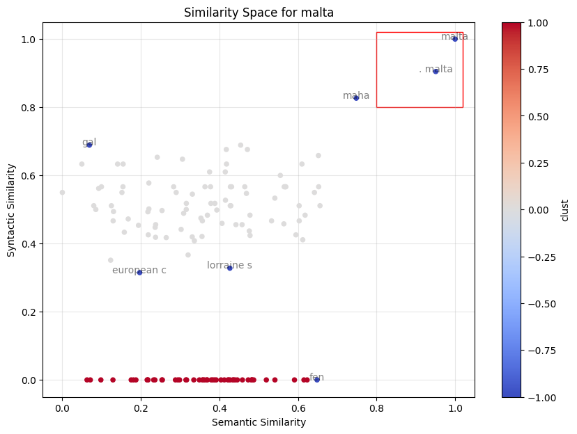

## Overview ##

An implementation of an "elastic anonymization" algorithm in which the pseudo-anonymization is made by building a similarity space for each sensitive entity in the text and by assigning the same fake entity to each word that falls in a sub-region of the similarity space: the anonymization region. 

Computationally speaking, the algorithm is designed to follow six steps:

1. A pre-trained fine tuned BERT model is used to perform named entity recognition and recognize all the sensitive entities in a given corpus. The entities can be:
    - **PER** for a person. For example, *"Barak Obama"*.
    - **ORG** for an organization. For example, *"ONU"*.
    - **LOC** for a location. For example, *"Wall Street, New York"*.
    - **MISC** for miscellanea. For example, service names.

2. The recognized entities are, then, inserted back into the original corpus.
3. A FastText model is trained on the new corpus.
4. For each new entity that needs to be anonymized, a similarity space is built as follows: the semantic (cosine) and syntactic (Jaro) similarities between the new entities and the ones found in the corpus are computed and an anonymization region is defined in that space (for example, the square defined by $x=(.80, 1); y=(.80, 1)$)
5. A DBSCAN algorithm is used to spot all the entities belonging to the anonymization region.
6. All the entities are anonymized using the same faking strategy. So, for example, if two entities are recognized in the text, let's say *"Meta Platform"* and *"Meta Platform Inc."*, and this two entities belong both to the same anonymization region, they'll be anonymized using the same fake entity.

Finally, the entities and their corresponding fakes are stored into the "anonymization state", a mapping 1 to many in which the keys are the recognized entities and the values are the corresponding fakes.

It's important to mention that these steps don't apply for entities like emails, fiscal codes or dates, which are spotted using standard regular expressions and stored in a separated anonymization state, the *"regex anonymization state"*.

## Why ##

Standard NER based anonymization algorithms are perfectly fine when we are in a static environment. In fact, when anonymized documents just need to be stored and used for future applications, we just want sensitive informations to be deleted from texts, as long as we are able to inverse-map the anonymized entities.<br>But what happen if we need to **dynamically retrieve** pieces of information, for example based on a user query?<br>Think about a semantic search or a RAG system in which we don't really know the exact mapping between the entities and their respective fakes. If the user writes a query using an entity that is anonymized in different ways (maybe because once the NER model recognizes *"Meta Platform"* and another time recognizes *"Meta Platform Inc"*) the query will retrieve only partial informations, as well as if the user writes an entity which is very similar to an anonymized one, but not exactly the same.

It's straightforwad to note that a standard anonymization strategy won't fit situations like the one described above, and that a more sophisticated approach is needed to account also for them. The proposed algorithm is well suited for both the mentioned scenarios: by leveraging both syntactic and semantic similarity, we ensure coherence in the 1 to many mapping strategy. In other words, similar entities will always be anonymized in the same way, increasing standardization in the stored chunks but also ensuring retrieving coherence for the users' queries.

## Repo Structure and Code ##

### The Algorithm ###

All the logic and the main functionalities of the algorithm are stored inside the anonymizer folder. The core file is ```elastic/eanon.py```, which contains the class ```ElasticAnonymizer```, where the six steps algorithm described in the overview is designed. The core method is ```anonymize```, which takes a list of Langchain's Documents and returns a dataframe in which each row is a chunk from the anonymized documents and the columns are the documents' and chunks' ids and the chunks' texts. The anonymize method requires an existing anonymization state to work properly so, if a pre-built one is not available, the function will also run the ```populate_anon_state``` method, which performs the first 3 steps of the algorithm and creates the 1 to many map. Both the anonymization state represented by the map and the trained Fast Text model can be saved using the methods ```export_anon_state``` and ```export_trained_embedder```. These will persist two artifacts in the **assets** folder.<br>
The anonymized chunks can also be saved locally using the function ```export_anon_df```.

### Data ###

As already mentioned, the anonymize method takes a list of Langchain's Documents. This can be easily created from a dataframe structured as having one document for each row and a document id. Other columns storing additional features regarding the document will be stored as metadata. This is particularly useful when the documents need to be used for retrieving systems, where metadata play an important role.<br>The documents dataframe can be easily created using the ```process``` function in ```preprocess/doc_processing.py```. The function takes the path to a folder, in which documents need to be stored. By default, this will be ```./data```. Once the dataframe is created, the function ```create_documents_with_metadata``` will take care of creating the list of Documents, which can then be passed to the anonymize method of ElasticAnonymizer.

For a comprehensive usage example, please refer to ```notebooks/usage.ipynb```.

### The Similarity Space ###

Since the core concept of the algorithm is the similarity space, a brief deep down on this point is required. As already stated, the similarity space is a two dimensional space defined by two measure of similarity: the **Jaro** and **Cosine** ones, representing, respectively, the syntactic and the semantic similarities. In other words, Jaro captures the pure similarity between the given word structure, while Cosine refers to the similarity of the word **given it's context**. The first can be computed in closed form, while the second needs the words to be transformed in vectors living in the embedding space.<br>Since we need to anonymize the entities **as recognized by the NER models**, the similarity space must be built for each of these, and this is the reason why the recognized entities must be inserted back into the original corpus, before giving it to the Fast Text model.

Once the entities have been recognized, the Fast Text trained and the words' embeddings created, the similarity space can be built. The following plot is an example of the similarity space for the entity "malta", extracted from a series of documents coming from the ([European Court of Human Rights](https://www.echr.coe.int/)).



## Setup Work Environment ##

### Installation and Usage ###

1. Clone the repository:
```bash
git clone https://github.com/Tobia905/elastic-anonymizer.git
```
2. Run:
```bash
pip install /PATH_TO_REPO
```
3. Anonymize your documents:
```python
from langchain.text_splitter import SentenceTransformersTokenTextSplitter

from anonymizer.preprocess.doc_processing import process
from anonymizer.elastic.eanon import ElasticAnonymizer
from anonymizer.utils import create_documents_with_metadata 

# the anonymize method from the ElasticAnonymizer class takes a list of langchain's Documents
docs_ = process(PATH_TO_YOUR_DATA).fillna("")
docs = create_documents_with_metadata(docs_)
# chunking is required from the BERT model to work properly (the inference breaks for long texts).
chunker = SentenceTransformersTokenTextSplitter(chunk_overlap=50, tokens_per_chunk=250)
chunks = chunker.split_documents(docs)

# this could take a while to execute. Also, a little bit of tuning of the Fast Text 
# parameters could be required (for example, epochs)
anon = ElasticAnonymizer(use_pretrained_anon_state=False, faking_locale="en_US")
anon_docs = anon.anonymize(chunks, show_ner=False, epochs=100)
```
4. Export your anonymized documents:
```python
# if you don't pass a PATH_TO_YOUR_FOLDER, the function will use the default argument, which is the ./anonymized_docs folder in the repo
ElasticAnonymizer.export_anon_df(anon_docs, PATH_TO_YOUR_FOLDER)
```
5. Optional - Export your anonymization states and trained Fast Text
```python
# if you don't pass a PATH_TO_YOUR_FOLDER, the function will use the default argument, which is the ./assets folder in the repo
anon.export_anon_state(save_path=PATH_TO_YOUR_FOLDER)
anon.export_trained_embedder(save_path=PATH_TO_YOUR_FOLDER)
```

### Docker ###
If you want to use the Elastic Anonymizer as a plain dockerized package, just follow these steps:

1. Clone the repository:
```bash
git clone https://github.com/Tobia905/elastic-anonymizer.git
```
2. Move your documents into the ./data folder

3. Make sure you have Docker installed and running.

4. Run:
```bash
docker-compose up
```
5. Go to: http://localhost:8888/tree and open the **usage.ipynb** notebook.

6. At cell 6, set SAVE_DOCS to True

7. Optional - At cell 7, set SAVE_ASSETS to True

8. Run the notebook.

9. You will find your saved anonymized documents inside the ./anonymized_docs folder and (optional) your anonymization states and trained Fast Text in ./assets. 

### Contribute ###

If you want to contribute to the project, feel free. The only thing we ask, is to follow these simple steps:

1. Fork the repository.

2. Clone the repository:
```bash
git clone https://github.com/<YourUserName>/elastic-anonymizer.git
```
3. Move to the repo:
```bash
cd /PATH_TO_REPO
```
4. Create a new branch:
```bash
# for a feature
git checkout -b feature/YOUR_FEATURE
# for solving a bug
git checkout -b bug/YOUR_SOLUTION
```
5. Push your branch and open a Pull Request.